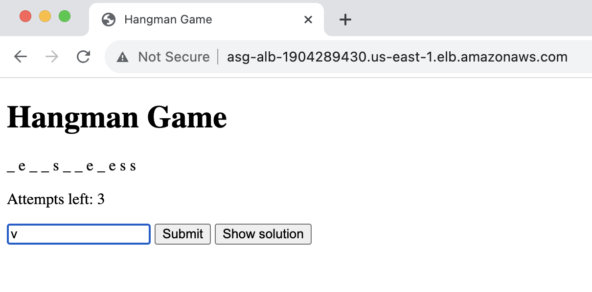

# The Terraform Multi-Cloud Application Challenge

This assignment is designed to practice infrastructure automation using Terraform to set up a multi-cloud application consisting of an API on Azure and a web frontend on AWS. 

The application is a simple word guessing game called Hangman. The API is implemented using FastAPI and the frontend is implemented using HTML and JavaScript. 

The assignment provides students with an opportunity to:

- Gain hands-on experience with Terraform
- Learn how to set up a multi-cloud application
- Understand how to provision cloud resources on multiple cloud providers
- Configure networking and security settings for the cloud resources
- Deploy and manage a multi-cloud application

To complete the assignment, students are required to:

1. Fork the template repository to their own Gitlab workspace
2. Review the code that is already provided:
    - `terraform.tf` contains the provider configuration for Azure, AWS and Docker.
    - `env.example` and `variables.tf` contain the variables that are used in the Terraform configuration, including the Azure and AWS credentials. Copy `env.example` to `.env` and fill in the credentials.
    - the remaining `.tf` files provide you a structure for the Terraform configuration.
    - `./hangman/` contains the FastAPI code for the Hangman API and `Dockerfile` is used to build the Docker image for the API.
    - `./hangman-front/` contains the HTML/JS code for the Hangman frontend.
3. Append your solution to the `.tf` files to provision the required cloud resources. **Add your initials as a prefix to all resource names!**
4. Deploy the application to your own Azure for Students and AWS Academy environments. The application should be deployable using only the `terraform plan` and `terraform apply` command and the URLs of the API and frontend should be printed to the console after the deployment.
5. Access the application from the Internet and you should be able to play the Hangman word guessing game.

6. Destroy the entire application using the `terraform destroy` command.

## General tips
- Deploying and destroying the full environment can take a long time. It is recommended to test your code by deploying only a subset of the resources. You can use the `-target` flag to specify the resources to deploy. For example, `terraform apply -target=azurerm_resource_group.test` will only deploy this resource and its dependencies.
- You can and should reuse the code that you have written in the previous assignments. Yes, the requirements for the AWS part are almost the same as the last Terraform exercise. You can copy the code from the previous assignment and modify it to fit the requirements of this assignment.
- The Terraform documentation is your best friend. You can find the documentation for the Azure provider [here](https://registry.terraform.io/providers/hashicorp/azurerm/latest/docs) and the documentation for the AWS provider [here](https://registry.terraform.io/providers/hashicorp/aws/latest/docs).

## Azure API
- You should activate your Azure for Students subscription if you have not done so already. You can find the activation link [here](https://azure.microsoft.com/nl-nl/free/students).
- The next step is to aquire some Azure credentials. You should create a service principal using the Azure CLI that uses the "Contributor" role and your Azure for Students subscription as the scope. [More info and instructions](https://learn.microsoft.com/en-us/cli/azure/azure-cli-sp-tutorial-1?tabs=bash#create-a-service-principal-with-role-and-scope). Insert these credentials into the `.env` file.
- The API is implemented using FastAPI and the code is provided in the `./hangman/` directory. The API is packaged into a Docker image and the `Dockerfile` is provided in the root directory. 
- The container image should be located in a Azure Container Registry which should also be created using Terraform. You can use the `azurerm_container_registry` resource for this purpose. Write this code in `az_con_registry.tf`.
- The API should be deployed as an Azure Container App. You can use the `azurerm_container_app` resource for this purpose. Write this code in `az_containerapp.tf`
    -  The container app needs an Ingress (sounds familiar?) to provide outside access to the API:
    ```terraform
    ingress {
      external_enabled = true
      target_port      = <your-container-port>
      traffic_weight {
        percentage      = 100
        latest_revision = true
      }
    }
    ```
    - It also needs a liveness probe to check if the API is ready to receive traffic, without this the container app will keep provisioning indefinitely. The hangman API has a `/liveness` endpoint that can be used for this purpose. Use the `liveness_probe` block to configure the liveness probe.
    - The API can be accessible any IP address for testing purposes. Print the URL of the API to the console after the deployment. 
### Challenge for extra points
- Use the [`docker` provider](https://registry.terraform.io/providers/kreuzwerker/docker/latest/docs) to **build the container image and push it** to the Azure Container Registry, automatically using Terraform. Write this code in `docker.tf`.
 
### Testing
You can test the API independently from the frontend by using the `curl` command. 

```bash 
$ curl -X POST https://tfcon-app--xqm9ag8.bravetree-4cee5eec.eastus.azurecontainerapps.io/hangman/new
{"guessed":"","attempts":6,"output":"_ _ _ _ _ _ _ _ _ "}                     
$ curl -X POST https://tfcon-app--xqm9ag8.bravetree-4cee5eec.eastus.azurecontainerapps.io/hangman/guess/a
{"guessed":"a","attempts":5,"output":"_ _ _ _ _ _ _ _ _ "}                    
$ curl -X POST https://tfcon-app--xqm9ag8.bravetree-4cee5eec.eastus.azurecontainerapps.io/hangman/guess/o
{"guessed":"ao","attempts":5,"output":"_ _ _ _ o _ _ _ _ "}                   
$ curl -X POST https://tfcon-app--xqm9ag8.bravetree-4cee5eec.eastus.azurecontainerapps.io/hangman/guess/t
{"guessed":"aot","attempts":4,"output":"_ _ _ _ o _ _ _ _ "}                  
$ curl -X POST https://tfcon-app--xqm9ag8.bravetree-4cee5eec.eastus.azurecontainerapps.io/hangman/guess/s
{"guessed":"aots","attempts":4,"output":"_ _ s _ o _ _ _ s "}                 
$ curl -X POST https://tfcon-app--xqm9ag8.bravetree-4cee5eec.eastus.azurecontainerapps.io/hangman/guess/p
{"guessed":"aotsp","attempts":3,"output":"_ _ s _ o _ _ _ s "}                
$ curl -X GET https://tfcon-app--xqm9ag8.bravetree-4cee5eec.eastus.azurecontainerapps.io/hangman/solution
{"solution":"discovers"}
```

## AWS frontend

- Fill in your AWS credentials in the `.env` file. Remember that these change everytime you restart the lab.
- **FUN TIP**: When your Learner Lab time has almost expired, you can click the *Start Lab* to get an additional 4 hours, without having to restart the lab.
- The frontend is implemented using HTML and JavaScript and the code is provided in the `./hangman-front/` directory. **DISCLAIMER** This is ugly prototype code generated by AI and will contains some bugs. However, you will be able to play the game.
- The frontend should run using a Automatic Scaling Group (ASG) and a Load Balancer (LB). Yes, you should reuse the code from the Terraform tutorial to save time. Add the code to aws_autoscaling.tf.
    - The ASG/ALB setup should make correct use of private and public subnets. The ASG should be deployed in the private subnet and the LB should be deployed in the public subnet. The ASG should be able to access the Internet through a NAT Gateway.
    - The necessary security groups should be created and follow the principle of least privilege. The ASG should only be accessible from the LB and the LB should only be accessible from the Internet.
    - The `hangman.js` file contains an `API_HOST` variable that should be replaced with the dynamically created URL of the API. You can use the [`template_file()` function](https://developer.hashicorp.com/terraform/language/functions/templatefile) to substitute the URL into the JavaScript code.
    - You also need a way to get the files onto the EC2 instances. You can use `cloud-init`, a [file provisioner](https://developer.hashicorp.com/terraform/language/resources/provisioners/file) or even `ansible`. Choose your destiny...
    - The frontend should be accessible from the Internet. Print the URL of the frontend to the console after the deployment.

## Evaluation

You will demonstrate this challenge to your teachers during the class after the deadline. You can find the deadline and evaluation criteria in Canvas.
